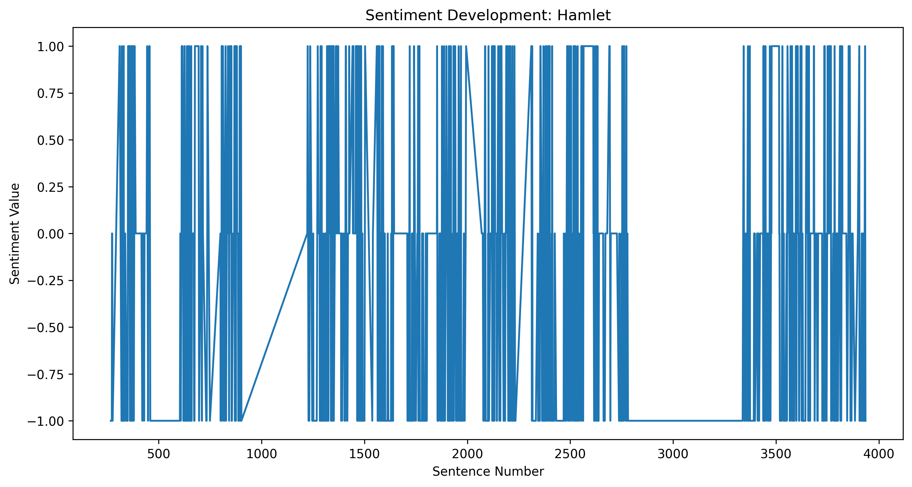
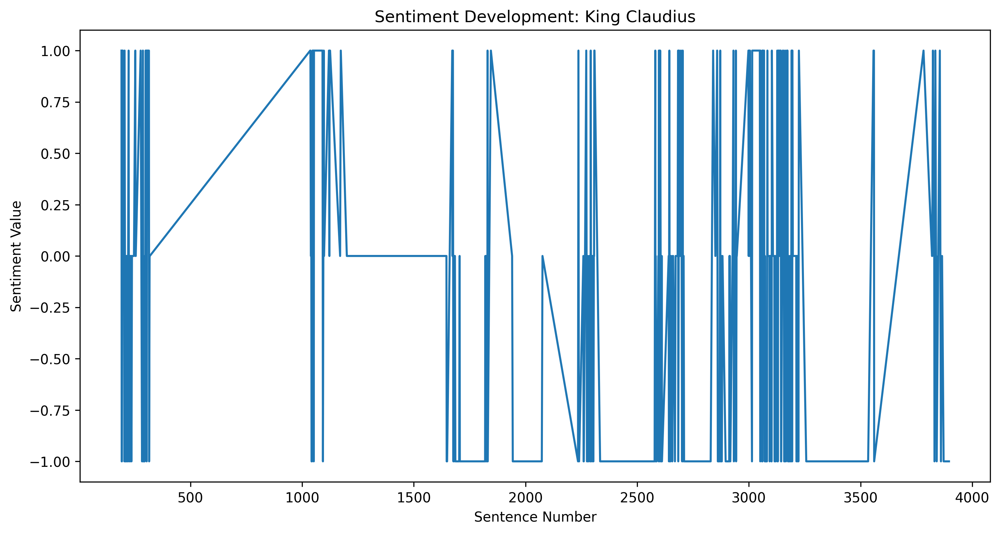

# Sentence-Level Sentiment and Emotion Analysis of Shakespeare's Plays

This repository contains a sentence-level sentiment and emotion analysis project based on Shakespeare's plays.

The workflow extracts spoken lines from Shakespeare XML files, selects major characters, applies Flair's pretrained sentiment classifier, and uses the OpenAI API to assign an emotion and sentiment label to each text unit. The resulting annotations are stored in JSON and Excel files and used for statistical analysis and visualization.

> **Note:** In this project, each `<LINE>` element in the source XML is treated as a sentence-level analysis unit. The workflow does not perform additional linguistic sentence segmentation.

## Project Overview

The analysis consists of two main parts.

### Part 1: Data Preparation and Flair Sentiment Analysis

The Part 1 scripts:

1. parse a Shakespeare play from an XML file;
2. extract spoken lines with their act, scene, speaker, identifier, and text;
3. identify speakers who appear in every act and have at least 50 extracted lines;
4. select two eligible speakers; and
5. apply Flair's pretrained sentiment classifier to the selected lines.

For each line, Flair produces:

* a binary sentiment label: `POSITIVE` or `NEGATIVE`;
* a confidence score between 0 and 1.

### Part 2: GPT Emotion and Sentiment Analysis

The selected lines are submitted individually to the OpenAI API using `gpt-4o-mini`.

For each line, the model predicts:

* one main emotion:

  * anger
  * anticipation
  * disgust
  * fear
  * joy
  * sadness
  * surprise
  * trust
* one sentiment:

  * positive
  * negative
  * neutral

The API is instructed to return a valid JSON object containing the two labels. The current implementation uses a temperature of `0.7`.

The experiment included in this repository focuses on:

* Hamlet
* King Claudius

In addition to their full sets of extracted lines, the script draws a random sample of 100 lines from the combined Hamlet and King Claudius pool.

## Dataset

The `dataset/` directory contains eight XML plays from the NLTK Shakespeare corpus:

* `a_and_c.xml` — *Antony and Cleopatra*
* `dream.xml` — *A Midsummer Night's Dream*
* `hamlet.xml` — *Hamlet*
* `j_caesar.xml` — *Julius Caesar*
* `macbeth.xml` — *Macbeth*
* `merchant.xml` — *The Merchant of Venice*
* `othello.xml` — *Othello*
* `r_and_j.xml` — *Romeo and Juliet*

## Repository Structure

```text
.
├── dataset/
│   ├── a_and_c.xml
│   ├── dream.xml
│   ├── hamlet.xml
│   ├── j_caesar.xml
│   ├── macbeth.xml
│   ├── merchant.xml
│   ├── othello.xml
│   └── r_and_j.xml
│
├── instruction/
│   └── Exercise 06.pdf
│
├── report/
│   └── discussion.txt
│
├── results/
│   ├── all_sentences_a_and_c.json
│   ├── all_sentences_dream.json
│   ├── all_sentences_hamlet.json
│   ├── all_sentences_j_caesar.json
│   ├── all_sentences_macbeth.json
│   ├── all_sentences_merchant.json
│   ├── all_sentences_othello.json
│   ├── all_sentences_r_and_j.json
│   ├── selected_speakers_hamlet.json
│   └── sentiment_analysis_hamlet.xlsx
│
├── scripts/
│   ├── part1_flair_sentiment_skeleton.py
│   ├── part1_sentence_extractor_skeleton.py
│   ├── part1_speaker_selector_skeleton.py
│   ├── part2_call_API.py
│   ├── part2_plots.py
│   ├── part2_sentiment_stats.py
│   ├── sample_part1_flair_sentiment.py
│   ├── sample_part1_sentence_extractor.py
│   └── sample_part1_speaker_selector.py
│
├── visualizations/
│   ├── play_claudius_sentiment_development.png
│   ├── play_hamlet_sentiment_development.png
│   ├── plot_1.png
│   ├── plot_2.png
│   └── plot_3.png
│
├── README.md
└── requirements.txt
```

The files ending in `_skeleton.py` are exercise templates. The corresponding `sample_part1_*.py` files contain implemented examples for Part 1.

## Installation

Clone the repository:

```bash
git clone https://github.com/barcetonio6668/sentiment_analysis_of_Shakespeare-plays_using_Chatgpt_API.git
cd sentiment_analysis_of_Shakespeare-plays_using_Chatgpt_API
```

Creating a virtual environment is recommended:

```bash
python -m venv .venv
```

Activate it on macOS or Linux:

```bash
source .venv/bin/activate
```

Activate it on Windows PowerShell:

```powershell
.venv\Scripts\Activate.ps1
```

Install the dependencies:

```bash
pip install -r requirements.txt
```

## OpenAI API Configuration

An OpenAI API key is required to run `scripts/part2_call_API.py`.

Set the `OPENAI_API_KEY` environment variable before running the script.

On macOS or Linux:

```bash
export OPENAI_API_KEY="your-api-key"
```

On Windows PowerShell:

```powershell
$env:OPENAI_API_KEY="your-api-key"
```

Do not place an API key directly in the source code or commit it to the repository.

## Usage

Run the following commands from the repository root. Some Part 1 scripts use relative paths or placeholder play names, so check their path variables before execution.

### 1. Extract Spoken Lines

```bash
python scripts/sample_part1_sentence_extractor.py
```

The script parses one Shakespeare XML file and produces a JSON file containing the extracted lines and their metadata.

A record follows this general structure:

```json
{
  "act": 1,
  "scene": 1,
  "speaker": "HAMLET",
  "sentence_id": 1,
  "text": "Example line"
}
```

In the current sample script, the play name is set directly in the source code:

```python
play_name = "dream"
```

The expected input and output locations may therefore need to be adjusted before running the script from the repository root.

### 2. Select Speakers

```bash
python scripts/sample_part1_speaker_selector.py
```

The script identifies eligible speakers based on their number of lines and their presence across acts. Two speakers can then be selected for further analysis.

The selected records are saved in a file following this pattern:

```text
selected_speakers_<play_name>.json
```

### 3. Apply Flair Sentiment Analysis

```bash
python scripts/sample_part1_flair_sentiment.py
```

The script applies Flair's pretrained sentiment classifier to each selected line and adds a sentiment label and confidence score.

Example:

```json
{
  "sentiment": {
    "label": "POSITIVE",
    "score": 0.98
  }
}
```

### 4. Run GPT Emotion and Sentiment Analysis

The API script accepts three command-line arguments:

```bash
python scripts/part2_call_API.py \
  <input_json_file> \
  <output_excel_file> \
  <max_sentences_per_speaker>
```

Example:

```bash
python scripts/part2_call_API.py \
  results/selected_speakers_hamlet.json \
  results/sentiment_analysis_hamlet.xlsx \
  50
```

The script reads the Flair-annotated JSON file, submits text units to `gpt-4o-mini`, and saves the combined annotations in an Excel workbook.

The workbook contains the following columns:

* `act`
* `scene`
* `speaker`
* `sentence number`
* `text`
* `flair_label`
* `flair_score`
* `gpt_main_emotion`
* `gpt_sentiment`

> The current implementation accepts `max_sentences_per_speaker` as a command-line argument but does not apply this value when constructing the final dataset.

### 5. Calculate Statistics

```bash
python scripts/part2_sentiment_stats.py
```

This script reads the Excel output and calculates sentiment and emotion statistics for the analyzed characters.

Check and, where necessary, update the input path defined in the script before running it.

### 6. Generate Visualizations

```bash
python scripts/part2_plots.py
```

This script generates visualizations comparing Flair and GPT sentiment classifications and showing sentiment development across the play.

## Results

The main experiment output is:

```text
results/sentiment_analysis_hamlet.xlsx
```

It combines:

* XML metadata;
* Flair sentiment labels;
* Flair confidence scores;
* GPT emotion labels;
* GPT sentiment labels.

The repository also contains intermediate JSON data and five generated visualization files.

### Example Visualizations

#### Hamlet sentiment development



#### King Claudius sentiment development



## Methodological Notes

Flair and GPT use different label inventories:

| System | Prediction task | Labels                         |
| ------ | --------------- | ------------------------------ |
| Flair  | Sentiment       | Positive or negative           |
| GPT    | Sentiment       | Positive, negative, or neutral |
| GPT    | Emotion         | Eight emotion categories       |

Because Flair does not provide a neutral class in this workflow, its predictions are not directly equivalent to the three-class GPT sentiment predictions.

The models also analyze each extracted line independently. They therefore do not receive information from the surrounding dialogue, scene, speaker history, or broader dramatic context. This is particularly relevant for Shakespearean text, where irony, figurative language, and contextual ambiguity can affect interpretation.

## Current Limitations

* The XML `<LINE>` elements are treated as sentences without additional sentence segmentation.
* Several scripts contain hard-coded or placeholder paths.
* The Part 1 skeleton files are incomplete templates.
* The GPT script is configured specifically for Hamlet and King Claudius.
* The `max_sentences_per_speaker` argument is not currently applied.
* The extra sample of 100 lines is drawn without a fixed random seed.
* Lines in the random sample are appended to the complete character datasets and may therefore occur more than once in the Excel output.
* No automated tests or explicit license file are currently included.

## Possible Improvements

Future development could include:

* replacing hard-coded paths with command-line arguments;
* making play and speaker selection configurable;
* applying the maximum-sentence argument correctly;
* separating full-data and random-sample experiments;
* setting a random seed for reproducibility;
* adding API retry and validation logic;
* incorporating scene-level or dialogue-level context;
* comparing model outputs with manual annotations;
* adding automated tests and a license.

## Acknowledgements

This project uses:

* XML texts from the NLTK Shakespeare corpus;
* Flair for pretrained binary sentiment classification;
* the OpenAI API for sentence-level emotion and sentiment analysis;
* openpyxl and pandas for tabular result processing;
* matplotlib for visualization.
